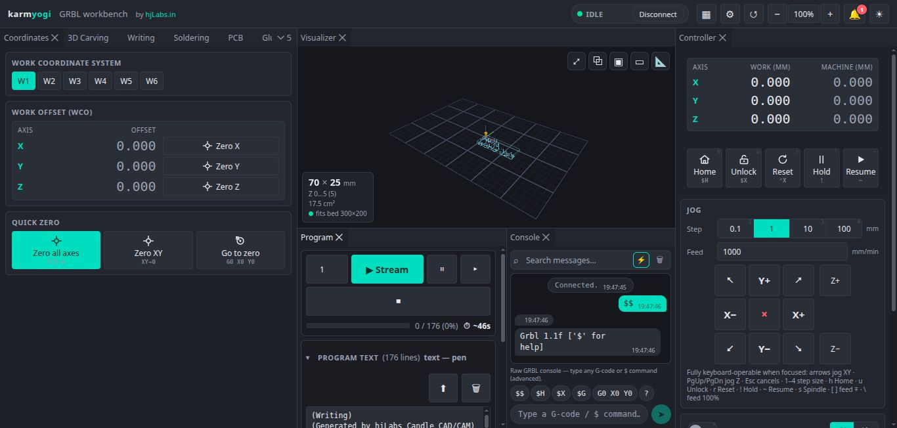
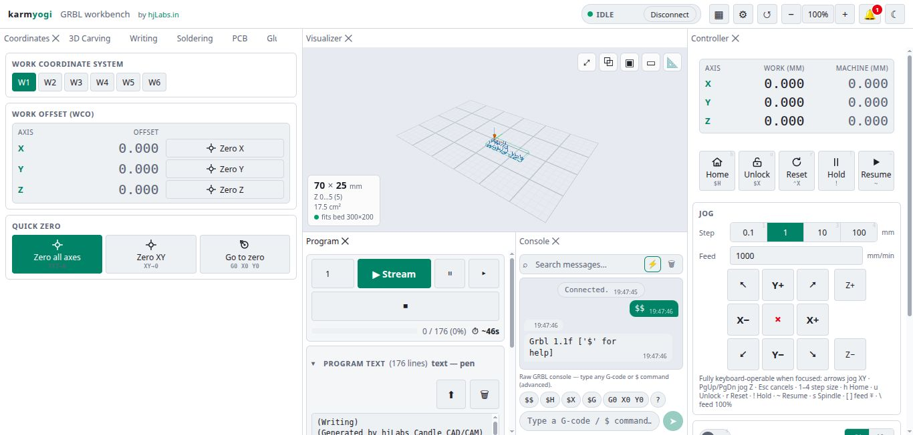
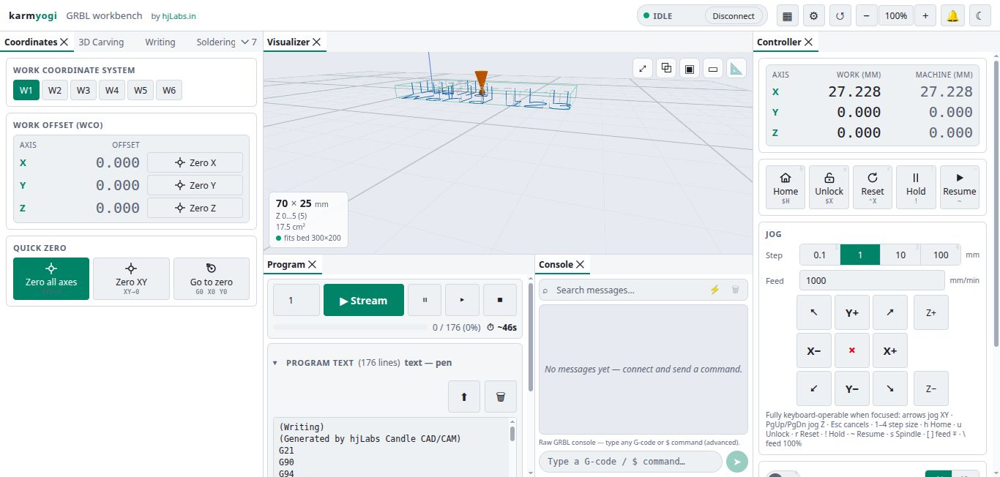
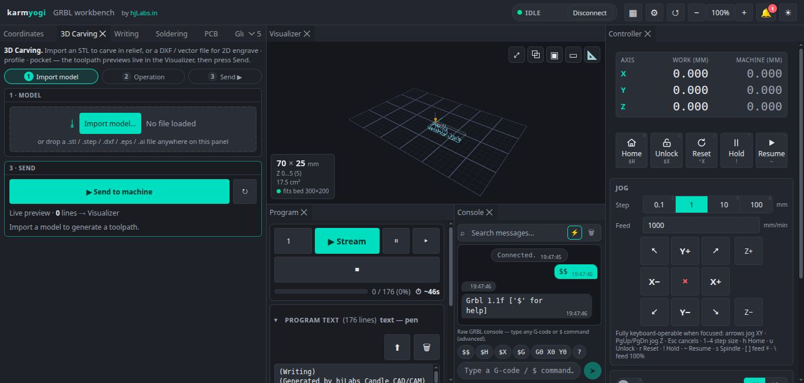
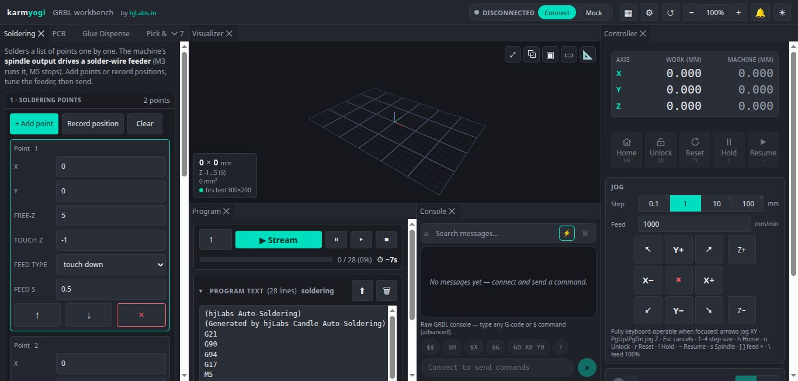
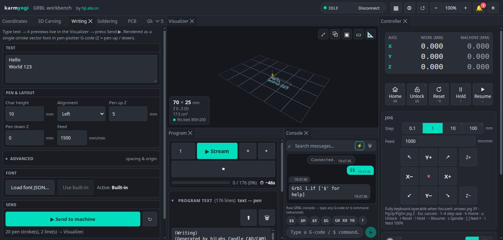
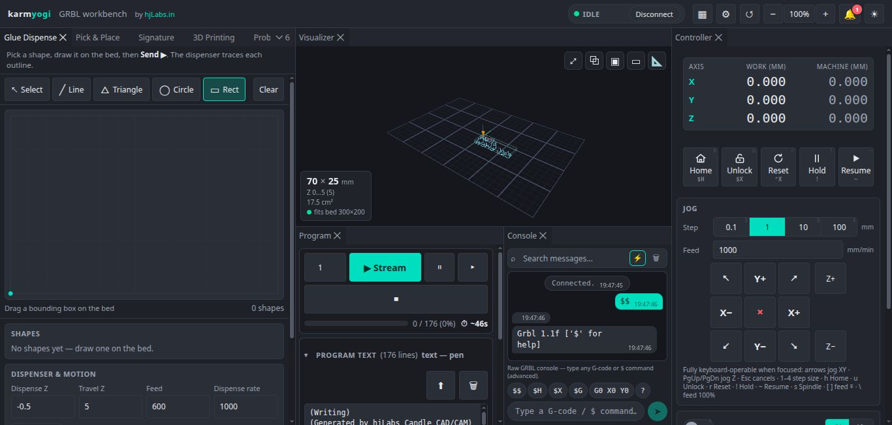

<div align="center">


# karmyogi

### A browser-based, dockable CAD/CAM + control workbench for 3-axis GRBL machines

CNC carving · pen-plotting · auto-soldering · PCB isolation routing · glue dispensing · pick &amp; place · signature-to-G-code · 3D printing — with a live 3D toolpath visualizer, jog/DRO controller, GRBL settings manager, and console. **Runs entirely in your browser over Web Serial.** No installs, no drivers, no server.

<br/>

[](https://karmyogi.hjlabs.in)

[](https://vitejs.dev)
[](https://react.dev)
[](https://www.typescriptlang.org)
[](https://threejs.org)
[](https://developer.mozilla.org/en-US/docs/Web/API/Web_Serial_API)
[](https://dockview.dev)
[](#-license)

<br/>

**[🚀 Open the live app → karmyogi.hjlabs.in](https://karmyogi.hjlabs.in)**

<br/>



</div>

---

## ✨ Features

karmyogi is a single-page workbench that turns any 3-axis GRBL machine into a
multipurpose tool — carving, plotting, soldering, dispensing, and PCB making —
without leaving the browser. Every mode is a **dockable, floatable, resizable
panel**, and every operation previews live in the 3D viewport before you send a
single line of G-code.

| Panel / Mode | What it does |
|---|---|
| 🕹️ **Controller** | Per-axis **DRO** (work + machine position), jog pad with step sizes, press-and-hold continuous jog, keyboard jogging, home / unlock / reset, feed-hold &amp; resume. |
| 🎚️ **Overrides** | Live feed, rapid, and spindle override controls. |
| 🖥️ **Console** | Raw GRBL console (send any `$`/G-code), **MDI** command entry, and macros. |
| 📐 **Coordinates** | Work coordinate systems **G54–G59**, set/go-to zero per axis. |
| 📄 **Program** | Load `.nc` / text, list view, **stream with progress**, feed-from-line, pause / abort. |
| 🧊 **Visualizer** | three.js **3D toolpath view** — bed grid, rapids vs cuts colored, tool marker, fit / iso / top / front views, theme-aware. |
| 🪵 **Wood CAD/CAM** | Import **DXF / STL**, then **engrave · profile (on/inside/outside) · pocket** with multi-depth passes and live preview. |
| ✍️ **Writing / Pen** | Type text → **single-stroke (Hershey) vector font** → pen-plotter G-code; load custom-font JSON. |
| 🔥 **Auto-soldering** | Editable points table (X/Y/**Free-Z**/**Touch-Z**/feed-type/feed-time), record-current-position, spindle output repurposed as a **solder-wire feeder** (M3/G4/M5). |
| 🧴 **Glue Dispense** | Draw shapes on the bed (line / triangle / circle / rect) → dispenser traces each outline with configurable dispense/travel Z and rate. |
| 🔌 **PCB** | Import **Gerber (RS-274X)** + **Excellon** → **isolation routing**, **drilling**, and **board cutout** as staged programs. |
| 🤖 **Pick &amp; Place** | Component placement workflow for assembly. |
| ✒️ **Signature** | Convert a captured signature to pen G-code. |
| 🧱 **3D Printing** | 3D-printing mode for the same GRBL motion platform. |
| ⚙️ **Motion / GRBL settings** | First-class `$`-settings editor: read `$$`, every setting **grouped + described** with units, edit/write, **range &amp; EEPROM-corruption validation**, and **factory reset** (`$RST=$ / # / *`). |
| 📷 **Camera / Timelapse** | Webcam view and timelapse capture of the job. |

**Across the whole app:**

- 🔌 **Web Serial** GRBL transport — connect over USB with a click; character-counting flow control, realtime bytes (`? ! ~ 0x18`), `<...>` status parsing.
- 🧪 **Mock serial device** — the entire app is fully usable (and demoable) **without hardware**.
- 🛡️ **Safe G-code by default** — always emits `G21 G90 G94 G17`, a guaranteed **safe-Z retract** before XY travel and at program end, conservative feeds, no `-0.000`, and **mode-configurable Z** (Spindle / Pen / Feeder).
- 🌗 **Light &amp; dark themes**, global UI zoom, persisted layout &amp; theme.
- 📱 **Fully responsive** — same controls and mental model on **desktop and phone**; the docking shell falls back to a stacked/tabbed mobile layout.
- 📦 **PWA / offline** and static hosting — installable, works offline, deploys as a static SPA.

---

## 🖼️ Screenshots

<table>
  <tr>
    <td width="50%" align="center">
      <br/>
      <sub><b>Dockable workbench (dark)</b> — drag, float, resize any panel</sub>
    </td>
    <td width="50%" align="center">
      <br/>
      <sub><b>Light theme</b> — same layout, persisted</sub>
    </td>
  </tr>
  <tr>
    <td width="50%" align="center">
      <br/>
      <sub><b>3D toolpath visualizer</b> — bed grid, rapids vs cuts, tool marker</sub>
    </td>
    <td width="50%" align="center">
      <br/>
      <sub><b>Wood CAD/CAM</b> — DXF/STL → engrave · profile · pocket</sub>
    </td>
  </tr>
  <tr>
    <td width="50%" align="center">
      <br/>
      <sub><b>Auto-soldering</b> — Free-Z/Touch-Z table + wire feeder</sub>
    </td>
    <td width="50%" align="center">
      <br/>
      <sub><b>Writing / Pen</b> — single-stroke font → pen G-code</sub>
    </td>
  </tr>
  <tr>
    <td width="50%" align="center">
      <br/>
      <sub><b>Glue Dispense</b> — draw shapes → dispenser traces outlines</sub>
    </td>
    <td width="50%" align="center">
      <a href="https://karmyogi.hjlabs.in"></a><br/>
      <sub><b><a href="https://karmyogi.hjlabs.in">…and more — open the live app →</a></b></sub>
    </td>
  </tr>
</table>

---

## 🛠️ Tech Stack

| Area | Choice |
|---|---|
| Build &amp; language | **Vite** + **TypeScript** (strict) |
| UI | **React 19** |
| 3D viewport | **three.js** via **@react-three/fiber** + **drei** |
| Docking shell | **dockview** (dockable / floatable / resizable panels) |
| State | **zustand** |
| Machine I/O | **Web Serial API** (`navigator.serial`) + a built-in **mock port** |
| Geometry / CAM | pure-TS core (`polygon-clipping` for offsets, `fflate` for Gerber ZIPs) |
| Offline | **PWA** (`vite-plugin-pwa`) |
| Hosting | static SPA on **Cloudflare Pages / R2** |
| Verification | **Playwright** in a real browser (no unit tests — visual closed loop) |

> **Heritage:** karmyogi is the web successor to the Qt/C++ desktop app
> `hjLabs.in_Candle`. The CAD/CAM core algorithms are ported from that
> reference implementation's C++ `cadcam` library into pure TypeScript.

---

## 🚀 Getting Started

> **Prerequisites:** Node.js 18+ and a Chromium-based browser (see
> [browser support](#%EF%B8%8F-browser-support) below). No machine required —
> a mock serial device ships in the app.

```bash
# 1. Clone
git clone https://github.com/hemangjoshi37a/karmyogi.git
cd karmyogi

# 2. Install
npm install

# 3. Run the dev server (Web Serial works on localhost)
npm run dev          # → http://localhost:5185

# 4. Build a static, deployable bundle
npm run build        # → dist/

# 5. Preview the production build
npm run preview

# Types only (no unit tests by design)
npm run typecheck    # tsc --noEmit
```

Then open the app, click **Connect** to pick your GRBL port (or choose **Mock**
to explore everything without hardware), and start jogging, carving, plotting,
or soldering.

---

## ⚠️ Browser support

karmyogi talks to your machine through the **[Web Serial API](https://developer.mozilla.org/en-US/docs/Web/API/Web_Serial_API)**, which has hard platform requirements:

- ✅ **Chromium-based browsers only** — Chrome, Edge, Opera, Brave.
- ❌ **Not** Firefox or Safari (no Web Serial support).
- 🔒 Requires **HTTPS or `localhost`** plus a **user gesture** (a click) to pick the port.

The hosted demo at **[karmyogi.hjlabs.in](https://karmyogi.hjlabs.in)** is served over
HTTPS, so connecting works there in any supported browser. Everything that
doesn't need hardware works in the **Mock** device on any setup.

---

## 🧱 Architecture

karmyogi keeps a clean separation so the CAM logic stays portable and the UI
stays trivial to rearrange:

```
src/
  app/        # shell: dockview layout, top bar, theme, panel registry
  store/      # zustand state slices (machine, program, settings, layout)
  serial/     # Web Serial GRBL transport + mock port (no UI)
  core/       # PURE TS CAD/CAM core — geometry, entity, toolpath,
              #   gcodeEmitter, dxf, offset, cam, soldering, strokeFont,
              #   gerber, excellon, pcbCam   (no React / DOM imports)
  viewer/     # three.js / r3f scene — bed, toolpath, tool marker
  panels/     # one dockview panel per file (UI only; calls core + store)
  components/ # shared dumb UI
  styles/     # light/dark theme variables
```

- **`src/core/` is pure and UI-independent** — no React or DOM imports. It
  mirrors the structure of the Qt reference's `cadcam` library, so the same
  G-code-safety and CAM behavior carries over exactly.
- **Each panel is its own file** under `src/panels/`, wired into the dockview
  shell through a central panel registry.
- **Serial, viewer, and core are three independent pillars** — the UI panels
  compose them.

---

## 🤝 Contributing

Issues, ideas, and pull requests are welcome — especially around new GRBL
machine modes and CAM operations.

- 🐞 **Report a bug or request a feature:** [github.com/hemangjoshi37a/karmyogi/issues](https://github.com/hemangjoshi37a/karmyogi/issues)
- 💻 **Source:** [github.com/hemangjoshi37a/karmyogi](https://github.com/hemangjoshi37a/karmyogi)

Development is done in a **closed loop** — change → run the dev server → drive
the real browser with Playwright → screenshot → judge → iterate. There are
**no unit tests** by design; everything is verified visually in the browser.

---

## 📣 Featured / Story

Read the story behind karmyogi and follow along on
**[LinkedIn → hemangjoshi37a](https://www.linkedin.com/in/hemangjoshi37a/)**.

---

## 📄 License

Released under the **MIT License**.

---

## Contact

**Hemang Joshi** -- Founder, [hjLabs.in](https://hjlabs.in)

[](mailto:hemangjoshi37a@gmail.com)
[](https://www.linkedin.com/in/hemang-joshi-046746aa)
[](https://www.youtube.com/@HemangJoshi)
[](https://wa.me/917016525813)
[](https://t.me/hjlabs)


<div align="center">

Built by **[hjLabs.in](https://hjLabs.in)**

[🚀 Live App](https://karmyogi.hjlabs.in) · [💻 GitHub](https://github.com/hemangjoshi37a/karmyogi) · [🐞 Issues](https://github.com/hemangjoshi37a/karmyogi/issues) · [🌐 hjLabs.in](https://hjLabs.in)

</div>
