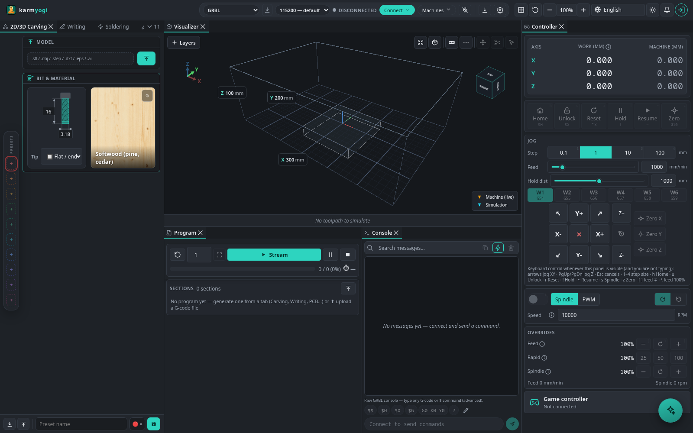
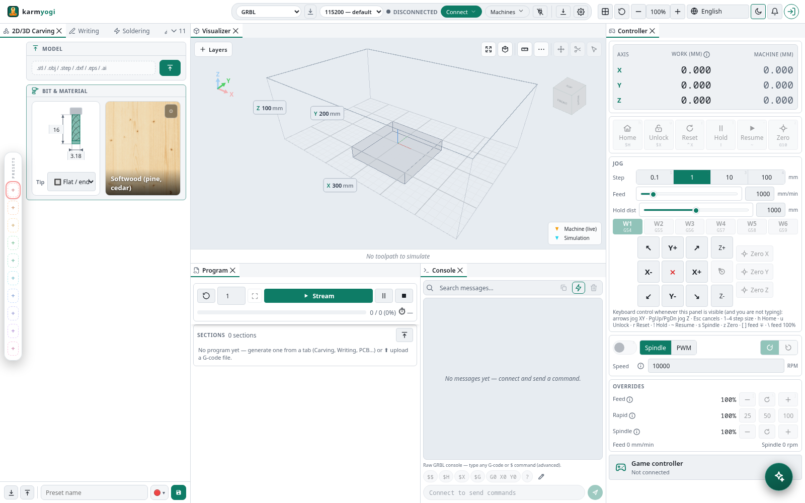
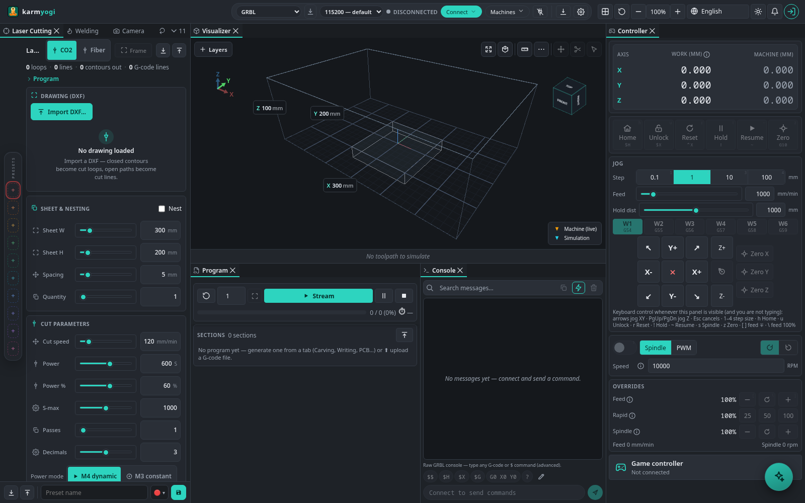
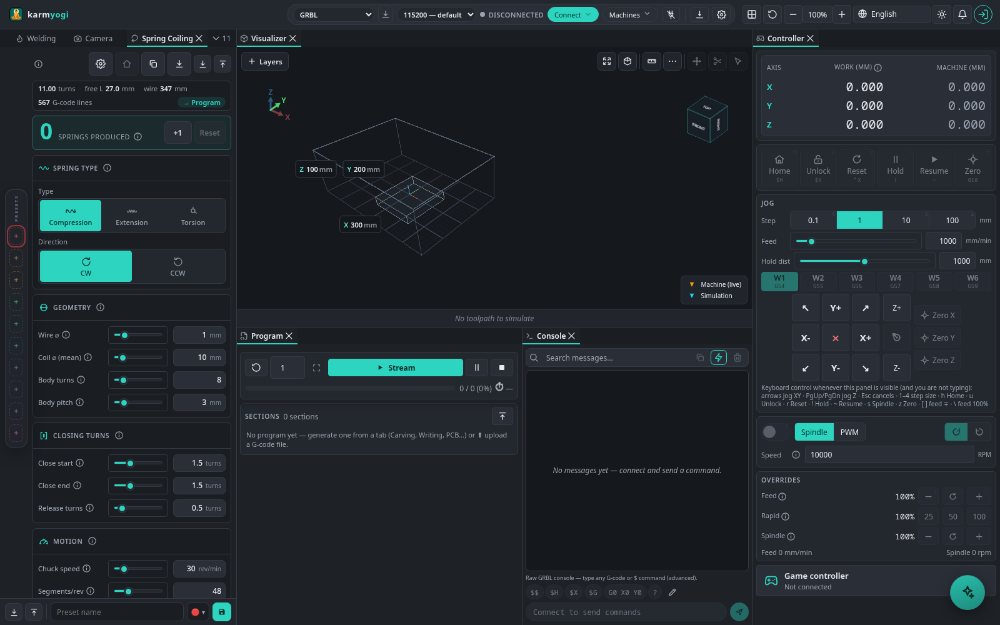
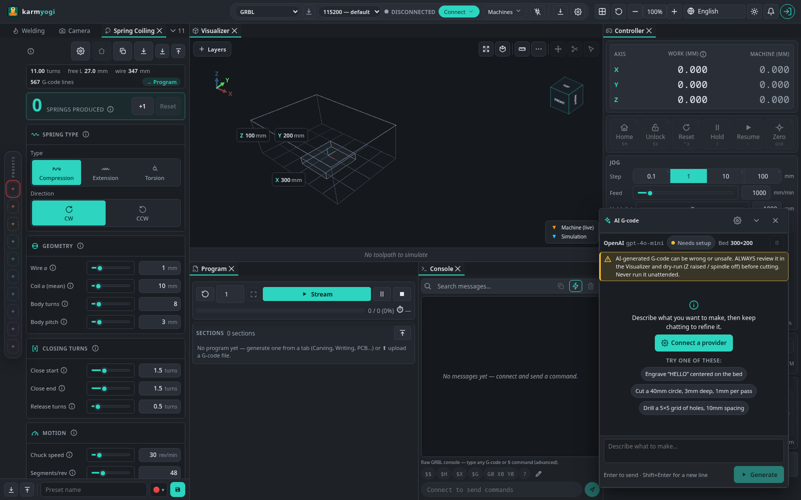
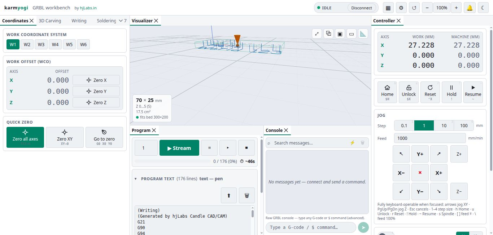
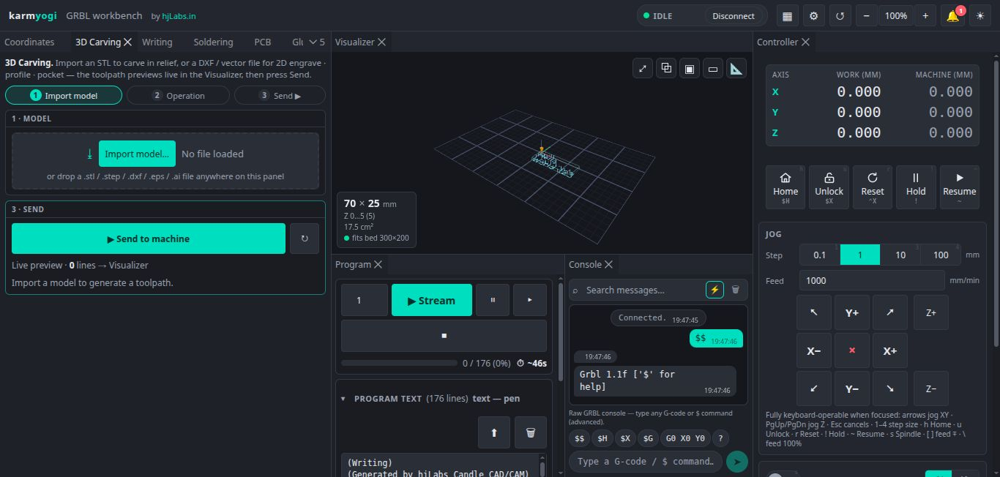
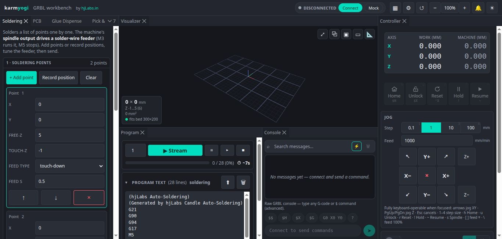
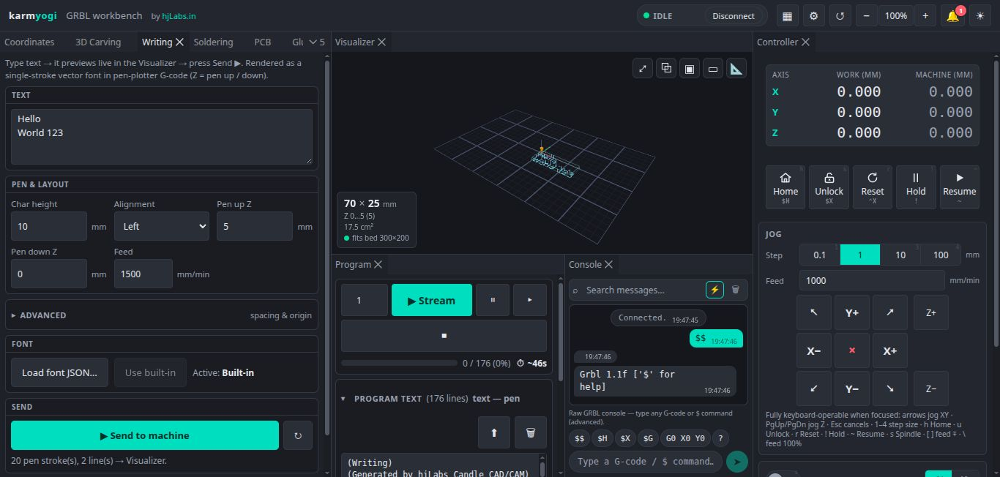
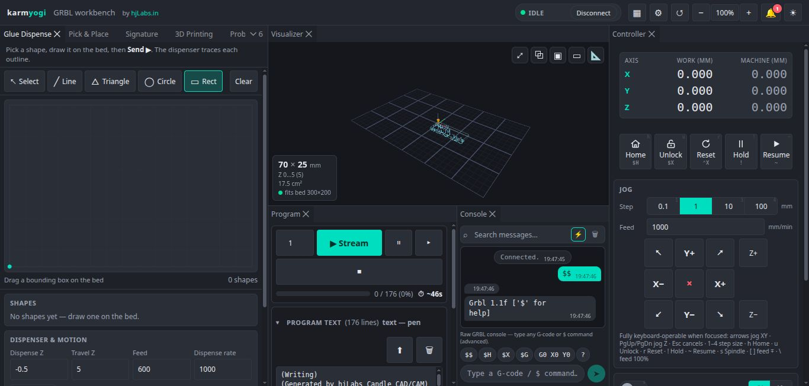

<div align="center">


<h1>karmyogi</h1>

<h3>The browser-native CAD/CAM + machine-control workbench for desktop GRBL machines</h3>

<p>
One dockable, 3D-visualized workbench for <b>CNC carving · laser cutting · pen plotting · PCB isolation routing · auto-soldering · glue dispensing · pick &amp; place · welding · screw fitting · drilling · spring coiling · 3D printing</b> — driven straight from your browser over <b>Web Serial</b>.
<br/><br/>
<b>No installs. No drivers. No server. No cloud round-trip.</b> Your files never leave the machine.
</p>

<br/>

[](https://karmyogi.hjlabs.in)
&nbsp;
[](https://www.linkedin.com/pulse/i-rebuilt-my-desktop-cnc-software-browser-meet-karmyogi-hemang-joshi-ceuif/)

<br/>


<br/>



<sub><i>The dockable workbench — every mode is a panel you can float, split, resize, or stack. Live 3D preview in the center, jog/DRO controller on the right.</i></sub>

</div>

<br/>

> [!TIP]
> **Try it in 10 seconds, no hardware needed.** Open **[karmyogi.hjlabs.in](https://karmyogi.hjlabs.in)** in Chrome/Edge, pick the built-in **Mock** device, and explore every panel, the 3D visualizer, and the G-code generator. Plug in a real GRBL board when you're ready.

---

## ✦ Why karmyogi

Desktop CNC software is heavy, OS-locked, and painful to extend. **karmyogi** is the opposite: a single static web app that turns *any* 3-axis GRBL-class machine into a multi-purpose tool, with a modern dockable UI and a live 3D toolpath preview before a single line of G-code is sent.

|  |  |
|---|---|
| 🌐 **Runs anywhere** | A static SPA in any Chromium browser — desktop or phone. Installable as a PWA, fully offline-capable. |
| 🔌 **Talks to your machine** | Connects over USB via the **Web Serial API** — no Electron, no Node bridge, no local server. |
| 🧰 **One tool, many jobs** | 14+ fabrication modes, from carving and laser to PCB routing, soldering, and spring coiling. |
| 🧊 **See before you cut** | Every operation renders live in a **three.js** 3D viewport — rapids vs. cuts, tool marker, bed grid. |
| 🛡️ **Safe by default** | Guaranteed safe-Z retracts, conservative feeds, mode-aware Z (spindle / pen / feeder), no `-0.000`. |
| 🤖 **AI-assisted** | Describe a job in plain English and the built-in assistant drafts safe, ready-to-run G-code. |

---

## 🖼️ Screenshots

<table>
  <tr>
    <td width="50%" align="center">
      <br/>
      <sub><b>Dockable workbench</b> — drag, float, split &amp; resize any panel</sub>
    </td>
    <td width="50%" align="center">
      <br/>
      <sub><b>Light &amp; dark themes</b> — same layout, persisted across sessions</sub>
    </td>
  </tr>
  <tr>
    <td width="50%" align="center">
      <br/>
      <sub><b>Laser cutting</b> — power/speed/passes, kerf, multi-pass, nesting</sub>
    </td>
    <td width="50%" align="center">
      <br/>
      <sub><b>Spring coiling</b> — wire/coil geometry, closing ends &amp; pitch → motion</sub>
    </td>
  </tr>
  <tr>
    <td width="50%" align="center">
      <br/>
      <sub><b>AI G-code assistant</b> — describe a job, get safe G-code</sub>
    </td>
    <td width="50%" align="center">
      <br/>
      <sub><b>3D toolpath visualizer</b> — bed grid, rapids vs cuts, tool marker</sub>
    </td>
  </tr>
  <tr>
    <td width="50%" align="center">
      <br/>
      <sub><b>2D / 3D carving</b> — DXF/STL/STEP/OBJ → engrave · profile · pocket</sub>
    </td>
    <td width="50%" align="center">
      <br/>
      <sub><b>Auto-soldering</b> — Free-Z/Touch-Z point table + wire feeder</sub>
    </td>
  </tr>
  <tr>
    <td width="50%" align="center">
      <br/>
      <sub><b>Writing / pen</b> — single-stroke vector font → pen G-code</sub>
    </td>
    <td width="50%" align="center">
      <a href="https://karmyogi.hjlabs.in"></a><br/>
      <sub><b><a href="https://karmyogi.hjlabs.in">Glue dispense + 8 more modes — open the live app →</a></b></sub>
    </td>
  </tr>
</table>

---

## 🧰 Everything in the workbench

<details open>
<summary><b>Machine control &amp; setup</b></summary>

| Panel | What it does |
|---|---|
| 🕹️ **Controller** | Per-axis **DRO** (work + machine position), jog pad with step sizes, **press-and-hold continuous jog**, keyboard jogging, **gamepad jog**, home / unlock / soft-reset, feed-hold &amp; resume. |
| 🎚️ **Overrides** | Live **feed**, **rapid**, and **spindle** override controls. |
| 🖥️ **Console** | Raw GRBL console (send any `$`/G-code), **MDI** command entry, and saved **macros**. |
| 📐 **Coordinates** | Work coordinate systems **G54–G59**; set / go-to zero per axis. |
| 📄 **Program** | Load `.nc` / text, list view, **stream with live progress**, run-from-line, pause / abort. |
| 🧊 **Visualizer** | three.js **3D toolpath view** — bed grid, rapids vs cuts colored, tool marker, fit / iso / top / front views, theme-aware. |
| ⚙️ **Motion / GRBL settings** | First-class `$`-settings editor: read `$$`, every setting **grouped + described** with units, edit/write, **range &amp; EEPROM-corruption validation**, **factory reset** (`$RST`). |
| 🎯 **Probe &amp; limits** | Z-probe / tool-length workflows and limit-switch status. |
| 📷 **Camera / Timelapse** | Webcam view, calibration overlay, and **auto-recorded timelapse** of the running job. |

</details>

<details open>
<summary><b>Fabrication modes</b></summary>

| Panel | What it does |
|---|---|
| 🪵 **2D / 3D Carving** | Import **DXF / STL / STEP / OBJ** → **engrave · profile (on/inside/outside) · pocket · 3D relief**, multi-depth passes, live preview. |
| 🔥 **Laser Cutting** | Power / speed / passes, **kerf** compensation, multi-pass, sheet **nesting** & quantity; CO₂ / fiber presets. |
| ✍️ **Writing / Pen** | Type text → **single-stroke (Hershey) vector font** → pen-plotter G-code; load custom-font JSON. |
| ✒️ **Signature** | Convert a captured signature into clean pen G-code. |
| 🔌 **PCB** | Import **Gerber (RS-274X)** + **Excellon** → **isolation routing**, **drilling**, and **board cutout** as staged programs. |
| 🌡️ **Auto-soldering** | Editable points table (X/Y/**Free-Z**/**Touch-Z**/feed-type/feed-time), record-current-position; spindle output repurposed as a **solder-wire feeder** (M3/G4/M5). |
| 🧴 **Glue Dispense** | Draw shapes on the bed (line / triangle / circle / rect) → dispenser traces each outline with configurable dispense/travel Z and rate. |
| 🤖 **Pick &amp; Place** | Component pick-and-place workflow for assembly. |
| 🪛 **Screw Fitting** | Automated screw-driving sequences. |
| 🕳️ **Bore / Drill / Hole** | Peck-drill / bore hole patterns with depth & retract control. |
| 🌀 **Spring Coiling** | Parametric wire/coil geometry (wire ⌀, coil ⌀, pitch, turns, closing ends) → coiling motion. |
| ⚡ **Welding** | Weld-bead / seam motion program. |
| 🧱 **3D Printing** | 3D-printing mode for the same GRBL motion platform. |
| 🪄 **AI G-code assistant** | A floating assistant — describe a job in plain English and get safe, ready-to-stream G-code. |

</details>

---

## 🔩 Firmware &amp; machine support

karmyogi speaks GRBL natively and adapts to several adjacent firmwares (experimental ones are clearly flagged in-app):

`GRBL` · `FluidNC` · `grblHAL` · `Marlin`* · `Smoothieware`* · `Masso G3 Touch`* · `Ruida`* · `EzCAD / BJJCZ (galvo fiber)`* · `Cypcut / FSCUT (fiber gantry)`*

<sub>* experimental</sub>

- 🔌 **Web Serial transport** — connect over USB with a click; character-counting flow control, realtime bytes (`?` `!` `~` `0x18`), `<…>` status parsing, selectable baud (9600 → 1 M, plus custom).
- 🧪 **Built-in mock device** — the entire app is fully usable (and demoable) **without any hardware**.
- 🛡️ **Safe G-code by default** — always emits `G21 G90 G94 G17`, a guaranteed **safe-Z retract** before XY travel and at program end, conservative feeds, no `-0.000`, and **mode-configurable Z** (Spindle / Pen / Feeder).

---

## ✨ Across the whole app

- 🌗 **Light &amp; dark themes**, global UI zoom, fully **persisted layout &amp; theme**.
- 📱 **Truly responsive** — the same controls and mental model on **desktop and phone**; the docking shell falls back to a clean stacked/tabbed mobile layout.
- 🌍 **53 languages** — full i18n with RTL support (Arabic, Hebrew, Urdu, …) covering every panel, tab, and control.
- 📦 **PWA / offline-first** — installable, works offline, with **forced background auto-update** so users always run the latest build.
- 🧹 **Low-RAM friendly** — bounded local caches and a one-click "free space" guard so it stays stable on modest machines.
- 🔐 **Optional Google sign-in** — a privacy-respecting gate with a free trial; degrades gracefully to fully-open when unconfigured.

---

## 🚀 Getting started

> **Prerequisites:** Node.js 18+ and a Chromium-based browser (see [browser support](#️-browser-support)). No machine required — a mock serial device ships in the app.

```bash
# 1. Clone
git clone https://github.com/hemangjoshi37a/karmyogi.git
cd karmyogi

# 2. Install
npm install

# 3. Run the dev server (Web Serial works on localhost)
npm run dev          # → http://localhost:5185

# 4. Build a static, deployable bundle
npm run build        # → dist/

# 5. Preview the production build
npm run preview

# Types only (no unit tests by design — see "Development")
npm run typecheck    # tsc --noEmit
```

Then open the app, click **Connect** to pick your GRBL port (or choose **Mock** to explore everything without hardware), and start jogging, carving, plotting, lasering, or soldering.

---

## ⚠️ Browser support

karmyogi talks to your machine through the **[Web Serial API](https://developer.mozilla.org/en-US/docs/Web/API/Web_Serial_API)**, which has hard platform requirements:

- ✅ **Chromium-based browsers only** — Chrome, Edge, Opera, Brave.
- ❌ **Not** Firefox or Safari (no Web Serial support).
- 🔒 Requires **HTTPS or `localhost`** plus a **user gesture** (a click) to pick the port.

The hosted app at **[karmyogi.hjlabs.in](https://karmyogi.hjlabs.in)** is served over HTTPS, so connecting works in any supported browser. Everything that doesn't need hardware works in the **Mock** device on any setup.

---

## 🛠️ Tech stack

| Area | Choice |
|---|---|
| Build &amp; language | **Vite** + **TypeScript** (strict) |
| UI | **React 19** |
| 3D viewport | **three.js** via **@react-three/fiber** + **drei** |
| Docking shell | **dockview** (dockable / floatable / resizable panels) |
| State | **zustand** |
| Machine I/O | **Web Serial API** (`navigator.serial`) + a built-in **mock port** |
| Geometry / CAM | pure-TS core (`polygon-clipping` offsets, `fflate` for Gerber ZIPs) |
| i18n | lightweight key/fallback layer, 53 locale bundles |
| Offline / install | **PWA** (`vite-plugin-pwa`, Workbox) |
| Hosting | static SPA on **Cloudflare Pages** |
| Verification | **Playwright** in a real browser (no unit tests — visual closed loop) |

> **Heritage:** karmyogi is the web successor to the Qt/C++ desktop app `hjLabs.in_Candle`. The CAD/CAM core algorithms are ported from that reference implementation's C++ `cadcam` library into pure, UI-independent TypeScript.

---

## 🧱 Architecture

karmyogi keeps a clean separation so the CAM logic stays portable and the UI stays trivial to rearrange:

```
src/
  app/        # shell: dockview layout, top bar, theme, panel registry
  auth/       # optional Google sign-in gate + One Tap / redirect flow
  store/      # zustand state slices (machine, program, settings, layout)
  serial/     # Web Serial GRBL transport + mock port (no UI)
  core/       # PURE TS CAD/CAM core — geometry, entity, toolpath,
              #   gcodeEmitter, dxf, offset, cam, soldering, strokeFont,
              #   gerber, excellon, pcbCam   (no React / DOM imports)
  viewer/     # three.js / r3f scene — bed, toolpath, tool marker
  panels/     # one dockview panel per file (UI only; calls core + store)
  components/ # shared dumb UI
  i18n/       # translation layer + 53 locale bundles
  styles/     # light/dark theme variables
```

- **`src/core/` is pure and UI-independent** — no React or DOM imports. It mirrors the Qt reference's `cadcam` library, so the same G-code-safety and CAM behavior carries over exactly.
- **Each panel is its own file** under `src/panels/`, wired into the dockview shell through a central panel registry.
- **Serial, viewer, and core are three independent pillars** — the UI panels compose them.

---

## 🤝 Contributing

Issues, ideas, and pull requests are welcome — especially around new GRBL machine modes and CAM operations.

- 🐞 **Report a bug or request a feature:** [github.com/hemangjoshi37a/karmyogi/issues](https://github.com/hemangjoshi37a/karmyogi/issues)
- 💻 **Source:** [github.com/hemangjoshi37a/karmyogi](https://github.com/hemangjoshi37a/karmyogi)

**Development is a closed loop:** change → run the dev server → drive the real browser with Playwright → screenshot → judge → iterate. There are **no unit tests** by design; everything is verified visually in the running app and type-checked with `tsc --noEmit`.

---

## 📣 Featured / story

Read the launch story — **[_I rebuilt my desktop CNC software in the browser — meet karmyogi_](https://www.linkedin.com/pulse/i-rebuilt-my-desktop-cnc-software-browser-meet-karmyogi-hemang-joshi-ceuif/)** on LinkedIn.

---

## 📄 License

Released under the **MIT License**.

---

## Contact

**Hemang Joshi** — Founder, [hjLabs.in](https://hjlabs.in)

[](mailto:hemangjoshi37a@gmail.com)
[](https://www.linkedin.com/in/hemang-joshi-046746aa)
[](https://www.youtube.com/@HemangJoshi)
[](https://wa.me/917016525813)
[](https://t.me/hjlabs)

<br/>

<div align="center">

Built by **[hjLabs.in](https://hjLabs.in)**

[🚀 Live App](https://karmyogi.hjlabs.in) · [💻 GitHub](https://github.com/hemangjoshi37a/karmyogi) · [🐞 Issues](https://github.com/hemangjoshi37a/karmyogi/issues) · [🌐 hjLabs.in](https://hjLabs.in)

<br/>


</div>
